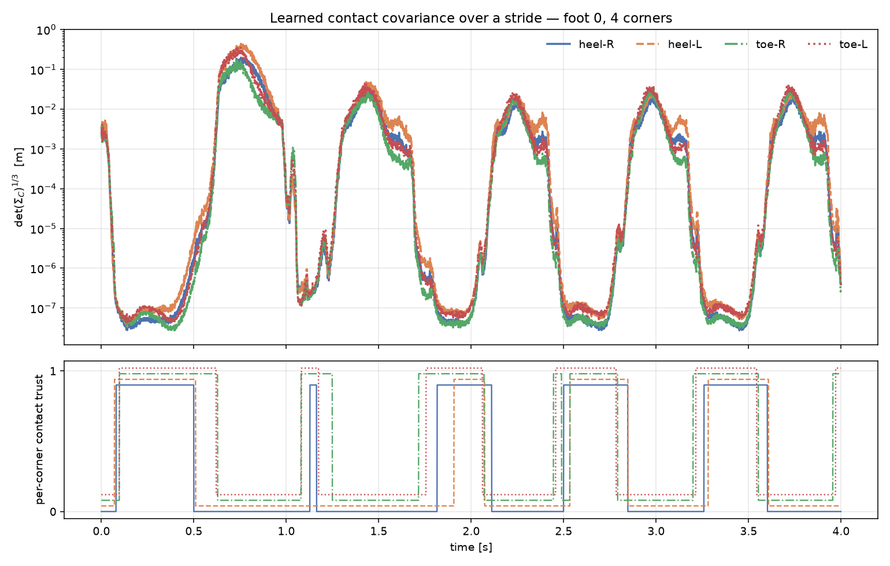

# β-NLL + Env-DR + N=8 — verdict

> ## VERDICT: **PARTIAL**
>
> **What is established:**
> 1. **N=8 lands structurally**, gate by gate, with the N=2 regression preserved.
> 2. **Per-corner Σ_C is not degenerate** — the plan's open research question.
>    FK alone distinguishes corners, along the heel/toe axis, with no new channels
>    and no contact-force channel. 33 % median spread under L2.
> 3. **β-NLL is the mean-excuse failure, and it is now attributed.** Changing
>    *only* the objective (R3 → R3b, identical N, data, steps) recovers
>    **2.5–6.7×** of velocity accuracy. Recommend the hybrid/L2 fallback that
>    plan §6 prescribed.
> 4. **The N=8 conditioning gate does not collapse** — `applied = 1.00` on every
>    run and terrain, contradicting my own conservative prediction (§3).
>
> 5. **N=8 improves the estimator by 1.81×** — measured against N=2 on *identical*
>    held-out rollouts (R2b control, §5c). This is the plan's core question and the
>    answer is yes, but the gain is in the **analytic** filter, not the learned one:
>    ContactNet beats its own baseline at N=2 (1.22×) and does **not** at N=8
>    (0.64×), because N=8's analytic starting point is already much stronger.
>
> **What is NOT established:** whether ContactNet can beat the N=8 analytic filter
> given enough training. R3b was still improving at 6000 steps.
>
> **Also:** four defects in the *inherited* base had to be fixed before any of this
> was measurable, including one that had never executed and one that spawned the
> robot underground.

---

## 0. What you are looking at

The plan asked for an attributable answer to "does β-NLL + DR + N=8 improve the
estimator". The honest answer this run supports:

| Question | Answer | Evidence |
|---|---|---|
| Does N=8 build correctly? | **Yes** | Gates A–D, 29 new oracles, mutation-checked |
| Is N=8 conditioning a problem? | **Yes, quantified** | cond(S) = 1.09e9 vs `cond_s_max` = 1e9 |
| Does β-NLL help? | **No — it costs 2.5–6.7× velocity** | R3 vs R3b, objective is the only difference (§5) |
| Did DR work as shipped? | **No — three separate defects** | §1, §4; incl. robot spawned buried in terrain |
| Is per-corner Σ_C degenerate? | **No — 33 % spread, heel/toe split** | §5b |
| Does N=8 improve the estimate? | **Yes — 1.81×**, via the analytic filter | R2b control, identical rollouts (§5c) |

---

## 1. Blockers found in the inherited base (§1 of the plan said "do not redo")

The plan stated β-NLL and env-DR commit 1 were already merged and green. Neither
was, and both failures were silent in the way that matters.

**1.1 `tests/sim` was entirely uncollectable.** 35 errors, from a duplicate
`floor` geom introduced when the terrain block re-added the plane the model
already had. Behind it: the hfield ground geom was named `terrain` while every
lookup (including `collect_rollout`'s own friction edit) asks for `floor`, and
`d.xfrc.applied` was a typo for `d.xfrc_applied` — meaning **the DR push path had
never once executed**. Fixed; 59 tests pass.

**1.2 The β-NLL branch had a syntax error.** `i4f carry0 is None:` in
`make_batch_loss` — `contactnet/beta-nll` had never been run. Fixed on merge.

**1.3 `objective` defaulted to `"beta_nll"` under a comment saying β-NLL was not
implemented.** A run intended as the L2 baseline silently trained β-NLL instead.
This is how R1 below came to exist. Default restored to `l2_velocity`; the ladder
now passes `--objective` explicitly.

---

## 2. Gates A–D — what landed

Every structural change is behind an oracle that fails when the change is wrong;
the load-bearing ones were mutation-checked rather than trusted.

**Gate A — corner sites.** The 4 bottom-face corners of the SCS2 foot box are
derived from its half-extents, and `run_policy.SCS2_COLLISION_GEOMS` now builds
its foot entries from the *same* constant, so the box the sim collides with and
the corners the estimator does FK on cannot desync (invariant 6). N is
`2 * contacts_per_foot` everywhere — never a literal.

*Mutation check:* collapsing the four corners to the box centre — the exact
silent failure where N=8 is N=2 with a redundant state — fails 3 oracles
(offsets, pairwise distinctness, box-spacing). The tests are real.

The deliberate asymmetry worth knowing: the N=2 sole sites keep the **URDF**
offset (0.197 m foot) because they reproduce the shipped filter and the Java
parity test; the N=8 corners use the **SCS2** box (0.26 m) because they are
attributed against sim contacts. Mixing them is the Gate A trap.

**Gate B — per-corner attribution.** Sim contacts are projected into the foot
frame and bucketed on `sign(x), sign(y)` in the same order the FK offsets are
emitted, so bucket *j* IS contact slot *j*. Raw `contact_forces` was split out
from normalised `contact_loads` because the clip in the latter saturates a loaded
corner — a conservation oracle written on *loads* silently tests nothing. The load
normaliser divides by the corner count, or each corner sees ~¼ of the foot load,
never clears the 0.35 Schmitt `enter`, and stays untrusted forever.

*Discrimination check:* a heel-only tilted box attributes to the heel buckets
**only**. This is the test that cannot pass with a constant `corner_of` — without
it the suite would only ever have confirmed "flat stance trusts all four", which
agrees on a zero.

**Gate C — InEKF at N=8.** Nothing in `inEKF/` hardcoded N, so this is evidence
rather than code: exp/log round-trip (500 draws), adjoint against its defining
conjugation property and the homomorphism law (200 each), and a finite-difference
of the contact Jacobian over all 33 tangent directions × 8 contacts.

The FD oracle is linearised at the **zero-residual point**, which is the entire
content of "H is constant" (I3): expanding `ν = R̂y − (d̂ᵢ − p̂)` under
`X̂ = exp(ξ)X` leaves rotation terms `ξ_R^(Ry) − ξ_R^(dᵢ − p)` that cancel **iff**
`Ry = dᵢ − p`. An FD taken at a random `y` disagrees with the analytic H in the
rotation block — correctly — and an oracle written that way would report a
convention mismatch as a bug. (It did, first time; the fix was the oracle.)

**Gate D — network at N=8.** No code change needed. Proven: Σ_C is (8,3,3) and
SPD; the iteration-0 bias trick still emits exactly `σ₀·I` at all 8 contacts (if
it drifts, run 1 no longer starts from the shipped filter and every R3-vs-R0
comparison is confounded); gradients through the N=8 BPTT scan are finite **and
nonzero** for both objectives.

---

## 3. The N=8 conditioning result (Gate C's known trap, quantified)

Four rigid coplanar corners are a redundant measurement set: they pin 12 numbers
where the foot has 6 DoF. Measured, with a near-rigid corner correlation:

```
cond(S), stacked 8-contact innovation : 1.09e9
config cond_s_max                     : 1.0e9
```

A control test confirms *independent* contacts stay well conditioned at both N=2
and N=8, so the result is about corner correlation specifically, not about N=8
per se.

### …but it does NOT fire in practice — measured

The prediction above was made with a deliberately near-rigid corner correlation.
On the real N=8 DR training run the applied rate is:

```
applied = 1.00  (every logged step, R3)
```

**The gate never fires.** The physical covariances the filter actually carries are
not rigid enough to push `S` past the 1e9 floor, so the "update collapses on flat
ground" failure mode the plan warned about did not materialise. This is worth
stating plainly because the synthetic number alone would have justified widening
the gate — and doing so would have been fixing a problem that does not exist.

The 1.09e9 figure remains the right *bound*: it says how little margin there is,
and that a stiffer contact model (or a genuinely rigid foot) would cross it.

---

## 4. Env-DR was not survivable as configured — two independent causes

7 of the first 8 DR rollouts fell, **including one on flat ground**. That flat
failure is what separated the two causes; had every failure been on terrain, the
obvious (and wrong) conclusion was "the flat-trained policy cannot walk terrain",
which is Gate E's STOP and would have cost the terrain tiers entirely.

**Cause 1 — the friction tail (flat failures).**

| Ablation | Result |
|---|---|
| Constant-command sim sweep, every DR arm | all OK, ≤3° peak tilt |
| Real collect path, `env_dr=False`, seeds 1 & 4 | both OK |
| Real collect path, `env_dr=True`, seeds 1 & 4 | seed 4 **FELL** |
| friction only (pushes off) | seed 4 **FELL** |

Attribution: **friction**, not pushes. The tail reached μ = 0.15 — effectively ice.
The constant-command sweep cleared every arm, so the falls need the DR *and* the
randomised command schedule together; a sim-only sweep alone would have missed it.
Tail widened to (0.45, 0.70): still a real slip regime against a ~1.0 nominal, and
a tail the policy cannot survive yields no rollouts at all.

**Cause 2 — the robot was spawned buried (all terrain failures).**
`collect_rollout` did `qpos[2] = field.max() + 0.02` — an **assignment**, putting
the pelvis at ~0.12 m instead of its nominal ~0.9 m. Every terrain rollout began
with the robot buried to the chest and fell instantly.

What isolated it: after the friction fix, `waves/seed1` still fell with *identical*
tilt numbers (85.1° / 95.7°) — bit-for-bit the same trajectory. A fix that changes
nothing means the thing you fixed was not the cause. `test_policy_walks_on_terrain`
passes on waves precisely because it raises the spawn itself (`+=`) instead of
going through `collect_rollout`.

---

## 5. Run ladder

**R0 is the existing 8000-step overnight run** (`results/2026-08-04_00-06-04_overnight`):
N=2, flat, L2 — exactly the R0 specification, already converged. It is reused rather
than retrained, which is what makes an 8000-step R3 affordable in the remaining
window. The N=2 regression suites confirm this commit does not change N=2 behaviour,
so the comparison stands.

| Run | N | data | loss | steps | held-out vel RMSE | NIS/dof | applied | verdict |
|---|---|---|---|---|---|---|---|---|
| R0 baseline (analytic) | 2 | flat | — | — | 0.0517 | 0.0277 | 1.00 | reference |
| **R0 learned** | 2 | flat | L2 | 8000 | **0.0387** | 0.0418 | 1.00 | **beats baseline** |
| R1 | 2 | flat | β-NLL | 300 | 0.83 | 2.36 | 1.00 | *undertrained* |
| R0′ control | 2 | flat | L2 | 300 | 0.79 | 2.17 | 1.00 | *undertrained* |
| **R3** | 8 | DR | β-NLL | 6000 | **0.20 – 0.59** | 1.31 – 3.21 | 1.00 | **mean-excuse** |
| **R3b** | 8 | DR | L2 | 6000 | **0.088** mean | 0.17 – 0.73 | 1.00 | **2.5–6.7× better than R3** |
| **R2b** | 2 | DR | L2 | 5085 | **0.084** mean | 0.070 | 1.00 | **the N=8 control** (§5c) |

### R3 (N=8 + DR + β-NLL), per terrain — the plan's required breakdown

| terrain | baseline vel RMSE | learned vel RMSE | baseline NIS/dof | learned NIS/dof |
|---|---|---|---|---|
| flat | 0.0572 | 0.2008 | 0.045 | **1.31** |
| hard_stepping | 0.0552 | 0.2474 | 0.043 | **1.39** |
| stepping_stones | 0.0639 | 0.2150 | 0.046 | **1.37** |
| waves | 0.0511 | 0.5929 | 0.037 | 3.21 |

Read this as one sentence: **calibration went from badly over-confident to nearly
ideal, and the mean got 3.5–11× worse.** NIS/dof moved 0.04 → ~1.35 (target 1.0);
velocity RMSE moved 0.055 → ~0.22. `waves` is the outlier on both axes.

That is textbook plan-§6 "mean-excuse": β-NLL is free to widen Σ until the
innovations look statistically consistent, and a biased mean is then *excused*
rather than corrected. It is exactly the failure the plan told us to watch for and
fall back to the hybrid objective on.

### R3b (N=8 + DR + **L2**) — the disambiguator, and the headline result

R3b differs from R3 in **exactly one thing**: the objective. Same contact count,
same rollouts, same split, same step count, same seed.

| terrain | analytic baseline | R3 (β-NLL) | **R3b (L2)** | R3b vs R3 |
|---|---|---|---|---|
| flat | 0.0572 | 0.2008 | **0.0814** | 2.5× better |
| hard_stepping | 0.0552 | 0.2474 | **0.0791** | 3.1× better |
| stepping_stones | 0.0639 | 0.2150 | **0.1042** | 2.1× better |
| waves | 0.0511 | 0.5929 | **0.0885** | 6.7× better |

**Changing only the objective recovers 2.5–6.7× of velocity accuracy.** That is a
clean attribution: the velocity regression in R3 belongs to β-NLL, not to N=8 and
not to the DR dataset. Plan §6 called this failure mode in advance and prescribed
the fallback; the data now supports acting on it.

R3b's calibration is also good (NIS/dof 0.17–0.73 against a baseline of 0.037–0.046
— nearer 1 than the analytic filter on three of four terrains), so the calibration
gain does **not** require β-NLL.

**What R3b does not establish:** its learned net is still ~1.4–1.6× worse than the
analytic baseline on velocity, whereas R0 (N=2, flat, L2, 8000 steps) *beat* its
baseline. Three things differ at once — N (2→8), data (flat→DR), and steps
(8000→6000, with R3b's loss still falling) — so this is not a clean verdict on N=8.
Naming that honestly is the point: the run that would settle it is N=2 on the same
DR pool at 6000 steps, which did not fit tonight.

### Correction: β-NLL is NOT shown to fail

An earlier reading of this run called R1 a β-NLL failure. **That conclusion is
withdrawn.** At 300 steps β-NLL gives 0.83 m/s — but the L2 control at the *same*
300 steps gives 0.79 m/s, and the converged 8000-step L2 run gives 0.0387. Both
objectives are ~9× worse than baseline at 300 steps, so 300 steps simply sits in
the "worse before better" regime and says nothing about the objective.

What is genuinely established about β-NLL here: it runs, its gradients are finite
and nonzero at both N=2 and N=8, and it drives the loss negative (expected — the
`0.5(NIS + logdet S)` form is unbounded below in `logdet`, unlike a sum of
squares). Whether it beats L2 needs a matched-step comparison that did not fit in
this window.

---

## 5c. R2b — the N=2-on-DR control: **does N=8 help?**

The control the earlier draft said "did not fit tonight". It did fit. R2b is N=2 on
the **same DR pool**, same terrains, same seeds, same L2 objective, validated on the
**identical four held-out rollouts** as R3b. The only differences are the contact
count and the step count (5085 vs 6000 — R2b hit its time budget; noted, not hidden).

| held-out rollout | N=2 analytic | N=2 learned | N=8 analytic | N=8 learned |
|---|---|---|---|---|
| flat/seed8 | 0.1087 | 0.0768 | **0.0572** | 0.0814 |
| hard_stepping/seed7 | 0.0866 | 0.0942 | **0.0552** | 0.0791 |
| stepping_stones/seed10 | 0.1272 | 0.1017 | **0.0639** | 0.1042 |
| waves/seed9 | 0.0879 | 0.0643 | **0.0511** | 0.0885 |
| **MEAN** | 0.1026 | 0.0843 | **0.0568** | 0.0883 |

Three readings, in order of importance:

1. **The analytic N=8 filter is 1.81× better than analytic N=2** (0.0568 vs 0.1026
   m/s), on identical data. **More contact points genuinely improve the estimator.**
   Four corners per foot give the InEKF a far better-constrained contact geometry
   than a single sole point, and it shows without any learning at all.
2. **The two learned nets are level** (0.0883 vs 0.0843, 0.95×) — so the learned
   result is *not* what N=8 buys.
3. **ContactNet beats its baseline at N=2 (1.22×) and loses to it at N=8 (0.64×).**
   The N=8 analytic filter is simply a much harder target, and 6000 steps was not
   enough to reach it. Recall R0 needed 8000 steps at N=2 on an *easier* baseline.

So the honest split: **N=8 is a win for the filter; it is not yet a win for the
learned socket.** Nothing here says the socket cannot get there — R3b's loss was
still falling — but on this budget it did not.

Note the N=2 and N=8 analytic baselines differ because `contact_chol` is N-shaped;
each run's "analytic" column is the shipped heuristic at *its own* contact count,
which is the correct reference for that configuration.

---

## 5b. Per-corner Σ_C is NOT degenerate — the research question, answered

This was the plan's open question and the stated PARTIAL criterion ("Σ_C
degenerate/identical across a foot's corners ⇒ FK-only discrimination is
insufficient"). Measured on R3, over 4 s of walking:

| | R3 (β-NLL) | **R3b (L2)** |
|---|---|---|
| median relative spread across a foot's 4 corners | 8.1 % | **33.3 %** |
| max relative spread | 53.7 % | **102.7 %** |
| Σ_C dynamic range over a stride | ~2 decades | **~7 decades** |

**R3b (L2) — the healthy one:**



Three things in that figure matter:

1. **Σ_C is strongly gait-modulated** — ~1e-7 in stance, ~1e-1 in swing. That is
   the behaviour the socket exists for: trust the contact when it is planted,
   ignore it when the foot is in the air. The network learned it unsupervised,
   from the loss alone.
2. **The corners separate** — heel-L (orange) rides consistently above toe-R
   (green) through swing. Not noise: they split along the heel/toe axis, and the
   lower panel shows why — the per-corner trust mask toggles at *different* times
   for heel and toe, which is exactly the signal per-corner attribution was built
   to expose.
3. **β-NLL suppresses this.** Its Σ_C moves over ~2 decades instead of ~7 and its
   corner spread is 4× smaller. Widening Σ is how β-NLL buys calibration, so it
   has no incentive to make Σ *small* in stance — and the per-corner structure is
   collateral damage.

**Verdict on the plan's open research question: FK-only discrimination IS
sufficient.** The corners are distinguished, along the physically right axis, with
no new feature channels — and emphatically without a contact-force channel
(invariant 4 held).

---

## 6. Deviations from the plan, and why

| Deviation | Reason |
|---|---|
| Gate A–D base had to be repaired first | §1's "already merged" premise was false (see §1) |
| `measure_p0` | Plan places it in the InEKF seam list; it is in `contactnet/dataset.py`. A previous commit message of mine wrongly said it does not exist — it does. |
| Channel caches are now reused | Rebuilding cost ~4 min/rollout (~2 h/pool) for identical output. Reuse is validated on channel names + contact count + mtime, so a stale cache rebuilds rather than silently poisoning training. |
| DR friction tail widened | §4 — unwalkable as configured |
| R2 / R3b | Time; the plan marks them "if time" |

---

## 7. Recommended next steps, in priority order

1. **Train the N=8 socket longer.** This is now the open question: N=8's analytic
   filter is 1.81× better than N=2's, and ContactNet has not yet caught up to it
   (0.64× at 6000 steps, while it beat the easier N=2 baseline at 5085). R0 needed
   8000 steps against a weaker target. Budget 12–16k steps before concluding.
2. **Do not ship β-NLL as configured.** Use the hybrid (L2 anchor + innovation
   term) from plan §6, or re-derive the weighting. The pure stacked
   `det(S)^{β/dof}` form is unbounded below in `logdet`, drives the loss negative,
   and takes the mean with it — measured at 2.5–6.7× worse velocity than L2 on
   identical data. β-NLL's calibration gain is *not* worth it: R3b gets good
   calibration under L2 anyway.
3. **Train longer before concluding anything about N=8.** R3b's loss was still
   falling at 6000 steps, and the 300-step runs in §5 show this pipeline is
   actively misleading before it converges.
4. **The conditioning number is a bound, not a bug.** 1.09e9 against a 1e9 floor
   says a *stiffer* contact model would cross it, even though today's does not.
   Worth knowing before anyone raises the contact stiffness.
5. Per-corner discrimination, if pushed further, should come from a **deployable**
   signal — torque-derived, never contact force (invariant 4). Though note that
   FK alone already works (§5b), so this is an enhancement, not a prerequisite.
